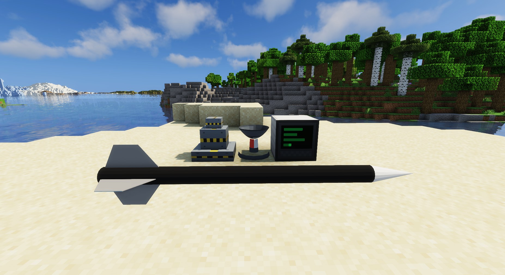

# Magic Missiles

A tech/military mod for Minecraft built around guided missiles. Set up a radar
station, point a silo at the sky, and watch a missile climb out of sight, cruise
across the map, and come down on something that had no idea it was coming.

Minecraft 1.21.1 · NeoForge

## Features

- **Missile Silo.** Launches guided missiles that boost, cruise high and dive onto
  their target. A nearby radar hands it a target; otherwise the missile's seeker hunts
  for one.
- **Missile Launcher.** Handheld, fires wherever you look.
- **Radar Station.** Sweeps a 32-block radius and tracks contacts.
- **Control Terminal.** Command line for remote launches: find and link a silo, set a
  target coordinate and cruise altitude, start a countdown.
- **Missile Display Stand.** Holds an MM1 missile for a close look.
- **Long range.** Missiles cross thousands of blocks over unloaded terrain, stay
  visible at any render distance (including Distant Horizons and Voxy), and survive
  server restarts.
- **Sound.** Delayed by distance, with its own falloff and doppler.

## Planned

- More missiles with different models and sizes
- Interception: missiles that shoot down other missiles
- Ammunition: silos that load and consume MM1
- Automatic fire on radar lock and redstone control
- Supersonic missiles
- Recipes
- Even fancier trails

## Gallery

## License

Magic Missiles is free software released under the [GNU General Public License v3](LICENSE).
